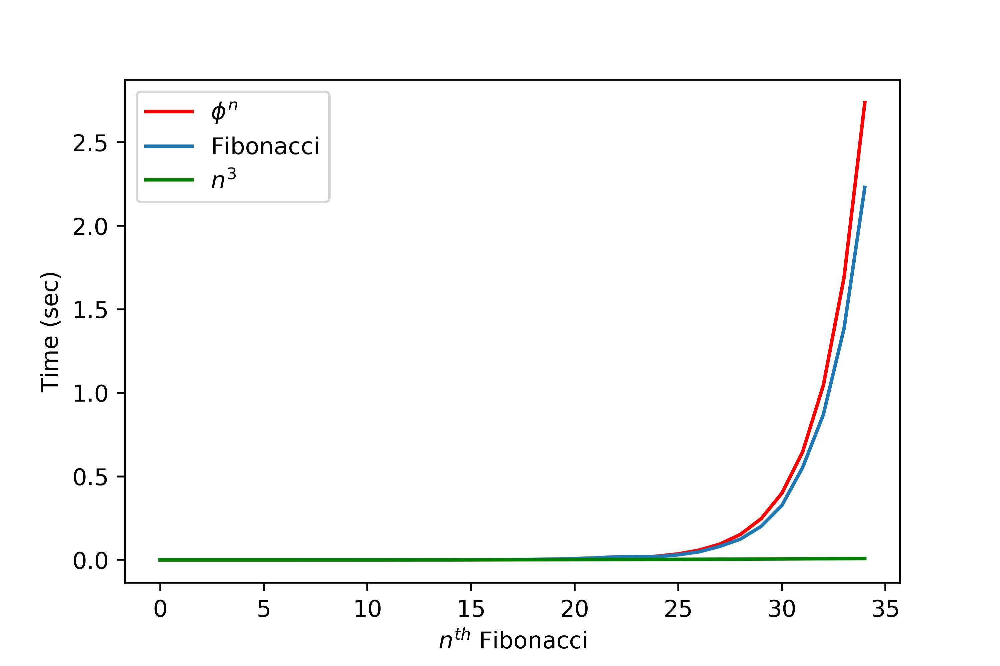
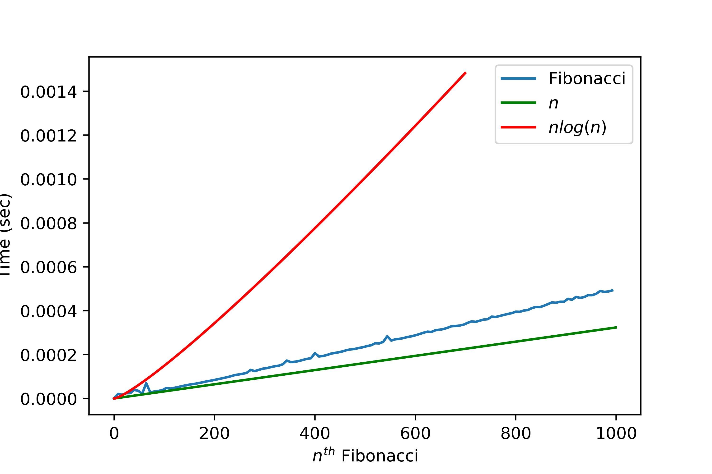
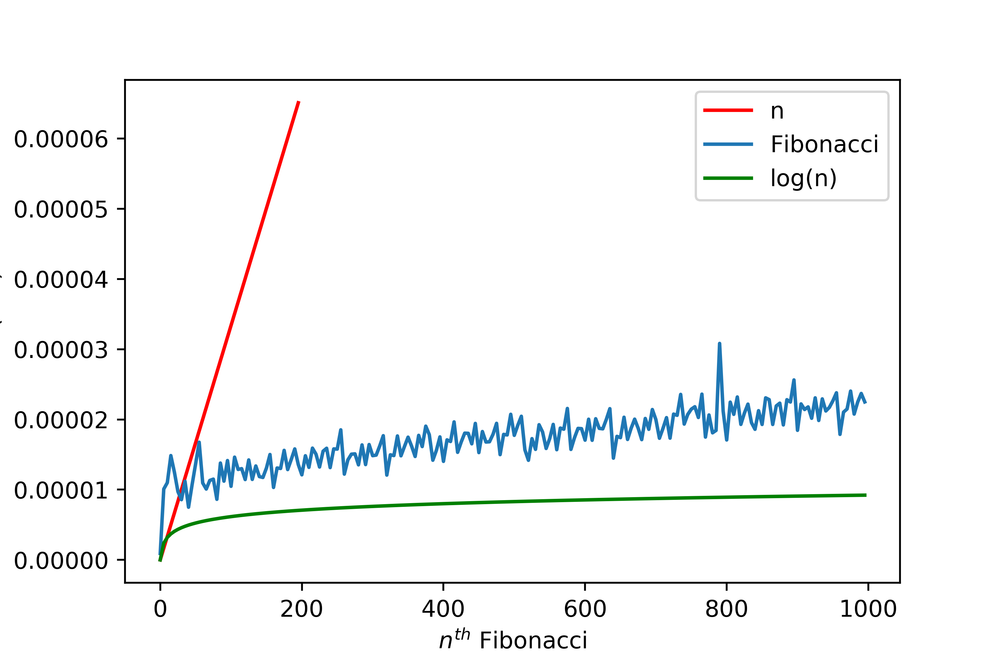

## Fibonacci

# 1-Recursive Fibonacci

- F(n) = F(n-1) + F(n-2) for n >= 2

- Exponential order O(phin) where phi is the golden ratio.

# 2-Linear Fibonacci
Calculate only once to the nth element.

# 3-Logarithmic Fibonacci
For n > 0:  
 

